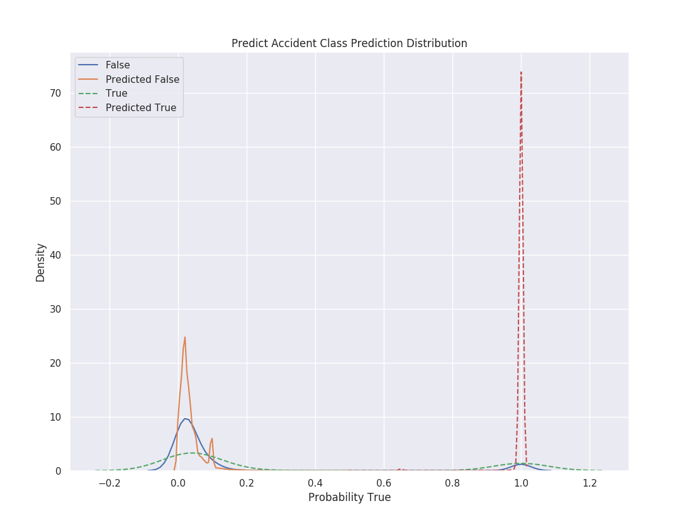
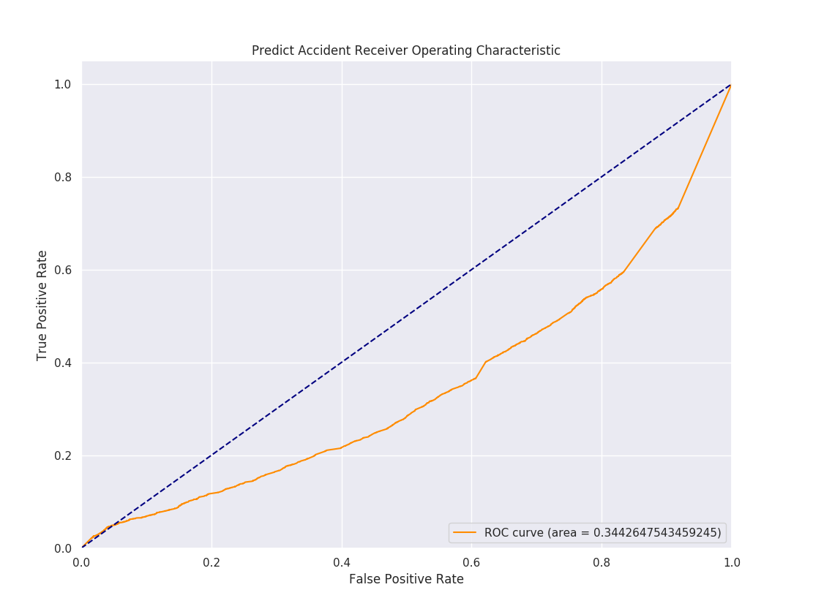
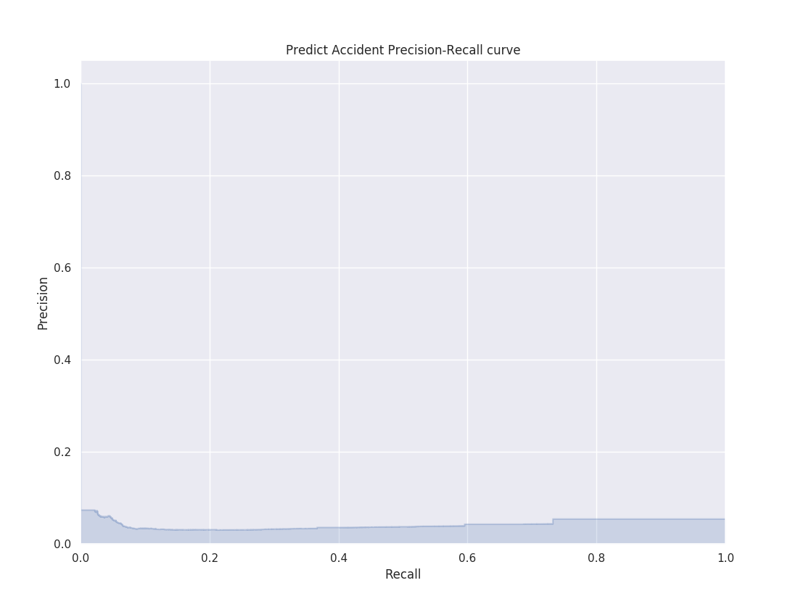

# Glow ML

Glow ML is a lightweight machine learning training and deployment framework. It is composed of two packages: 
**glow_ml** which is a flask microservice API to deploy models and deliver predictions, and **glow_ml_train**
which is a command line tool to train models and prepare them for deployment. Additionally, **Glow ML** 
includes a utility to output stats for deployed models: **model_test.py**.

## Installation

Glow ML requires python 3.6 or greater. The installation instructions here are for MacOSX using [homebrew](https://brew.sh "Homebrew"), 
[pyenv](https://github.com/pyenv/pyenv "pyenv") and 
[pyenv-virtualenv](https://github.com/pyenv/pyenv-virtualenv "pyenv-virtualenv").

### One: Install Homebrew

```bash
/usr/bin/ruby -e "$(curl -fsSL https://raw.githubusercontent.com/Homebrew/install/master/install)"
```

[Detailed installation instructions](https://brew.sh "Homebrew")

### Two: Install pyenv and pyenv-virtualenv

```bash
brew install pyenv
```

[Detailed installation instructions](https://github.com/pyenv/pyenv#homebrew-on-mac-os-x)

```bash
brew install pyenv-virtualenv
```

Add the following to your shell profile:

```bash
eval "$(pyenv init -)"
eval "$(pyenv virtualenv-init -)"
```

[Detailed installation instructions](https://github.com/pyenv/pyenv-virtualenv)


### Three: Install python 3.6 or greater

To see a list of all available versions do this:

```bash
pyenv install --list
```

Glow ML was developed using the vanillia version of python `3.7.0` (don't use versions that have 
`anaconda-` or `pypy-` in them). 

To install python:

```bash
pyenv install 3.7.0
```

You can now check to see what versions are installed using:

```bash
pyenv versions
```

### Four: Create a virtual python environment for Glow ML

```bash
pyenv virtualenv 3.7.0 glow_ml
```

Activate this virtual environment:

```bash
pyenv activate glow_ml
```

Your shell prompt should now look someting like this:

```bash
(glow_ml) The-Queen-of-Cups:
```

To deactivate the virtual environment do this:

```bash
pyenv deactivate
```

### Five: Install python dependencies

From the active virtual environment, install using `pip`:

```bash
pip install --upgrade -r requirements.txt
```

Congratulations! You are ready to go.

## Running tests

### Unit tests

**Glow ML** uses `pytest` for unit test discovery and execution.  To run tests do this:

```bash
pytest -v
```

### Model tests

In addition to unit tests, **Glow ML** also includes a model testing package. This assumes that there is a
serialized model present in the `glow_ml/models` directory, and that there is testing data in the `glow_ml_train/data`
directory. A model and testing data is included in the github repo so you can run the model testing package. The model
testing package runs in two modes: the first loads the model directly into the testing package, the second sends all
testing data through the API. The first mode can be run like this (from the main `glow_ml` project directory):

```bash
python -m model_tests predict_accident
```

The second mode requires that an API server is running. See [Running the server](#running-the-server) for instructions
on how to do this. Once the server is running, the model tests can be run through the API by simply passing the the 
API URL using the `--test_url` command line option.

```bash
python -m model_tests predict_accident --test_url http://127.0.0.1:5000/api/v1.0/predict_accident
```

Both methods should produce identical results for the same model.

Help text is available for the model_tests utility and can be accessed using the `-h` option:

```bash
python -m model_tests -h
```

## Running the server

Flask includes a handy web server to run projects locally. To get this set up in development mode do the following from
the main **Glow ML** project directory:

```bash
export FLASK_ENV=development
export FLASK_APP=glow_ml:glow_ml_app
flask run
```

## Making predictions

Predictions can be made through the API by sending features using POST to the prediction endpoint as JSON. For example, 
posting

```json
[{
	"risk_score": 7.318181,
	"gender": "M",
	"age": 30.0,
	"years_experience": 36.0,
	"role": "Employee",
	"company": 89,
	"state": 2.0,
	"hours_worked_per_week": 36.914861
},
{
	"risk_score": 4.435424,
	"gender": "M",
	"age": 24.0,
	"years_experience": 6.0,
	"role": "Employee",
	"company": 41,
	"state": 4.0,
	"hours_worked_per_week": 57.901800
}]
```

to `/api/v1.0/predict_accident` will return something like this:

```json
[
    [
        false,
        [
            0.9361030176173346,
            0.06389698238266536
        ]
    ],
    [
        false,
        [
            0.9022109643611187,
            0.09778903563888125
        ]
    ]
]
```

Each feature row submitted will result in a prediction row with the predicted value (either `true` or `false`) and the 
probability of being `false` or `true` in that order. In the above example, the first feature row results in a `false`
prediction with ~93.6% probability.

## Training a model

The **glow_ml_train** package provides a command line utility for training new models. There are many options here and
some of them could take a very long time to execute and result in poor model performance. To run a quick example that
should perform fairly well do this:

```bash
python -m glow_ml_train.train predict_accident --holdout 0.8
```

This will train a gradient boosted tree model with 20% of the data provided, leaving 80% for testing. See the 
[Discussion](#discussion) below for more information about the modeling process.

Help text for the **glow_ml_train** package can be accessed using the `-h` option:

```bash
python -m glow_ml_train.train -h
```

## Discussion

Modeling in general can be a tricky business, and models are only as good as the data provided. The model that was 
developed for this project should be thought of as an initial crack at the problem and not the final solution. That 
being said, the final model that is included in this package does a really good job of predicting when workers *won't* 
have an accident. It does not do a great job of predicting when they *will*. Let's look at the stats:

```bash
### Stats for the "Predict Accident" model ###
Confusion Matrix
|   1180   |   6668   |
|   3104   |  69048   |
Accuracy: 0.87785
Precision: 0.15035677879714576
Recall: 0.2754435107376284
F1: 0.19452687108473457
True Negative Rate: 0.9119340694172963
Negative Predictive Value: 0.9569797095021622
False Positive Rate: 0.08806593058270373
False Negative Rate: 0.7245564892623716
False Discovery Rate: 0.8496432212028542
False Omission Rate: 0.04302029049783784
```

There is a good discussion of what all of these stats mean [here](https://en.wikipedia.org/wiki/Precision_and_recall).
The confusion matrix is laid out like so:

```text
|  true positive   |  false positive  |
|  false negative  |  true negative   |
```

The main things to focus on here are the *True Negative Rate* and the *Negative Predictive Value*. The *True Negative 
Rate* is analogous to *Recall* and specifies the percentage of actual false elements that were selected by the model. 
The *Negative Predictive Value* is analogous to *Precision* and specifies the percentage of false elements that were
correctly identified as false.

Another way to visualize what is going on is to look at how the model probabilities separate the classes.
 


As you can see in the diagram above, the *false* and *predicted false* distributions (solid lines) peak in the same 
region (low probability because the plot is of the probability that the prediction is true). However, the *true* and 
*predicted true* distributions (dashed lines) do not overlap as much. 

Lastly, the **model_tests** utility also produces [ROC diagrams](https://en.wikipedia.org/wiki/Receiver_operating_characteristic)
and [precision-recall diagrams](http://scikit-learn.org/stable/auto_examples/model_selection/plot_precision_recall.html).





### Model development notebooks

The `notebooks` directory in the main **Glow ML** directory contains a jupyter notebook with all of the exploratory 
modeling work. 

